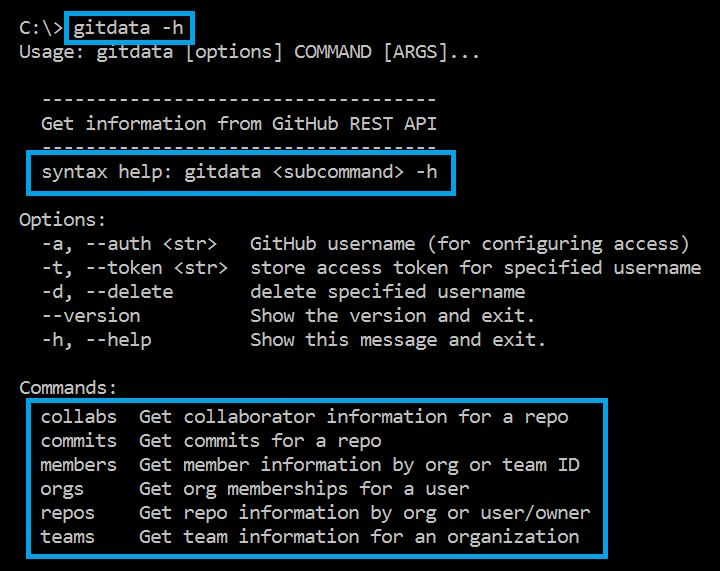
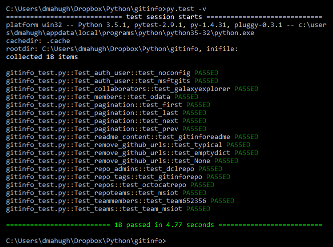

<properties LandingPageTags="Python,GitHub,REST,OSPO" />
# gitdata
A command-line tool for querying GitHub APIs to retrieve information about repos, organizations, teams, and collaborators. Provides a simple and consistent syntax for retrieving data in JSON or CSV format.

  

Simple usage example &mdash; list repos for the *octocat* user:
```
c:\> gitdata repos --user=octocat --source=API
octocat,git-consortium
octocat,hello-worId
octocat,Hello-World
octocat,octocat.github.io
octocat,Spoon-Knife
octocat,test-repo1
c:\>
```
All JSON data returned by the GitHub API is cached locally, enabling fast offline queries. Here's a query that returns the license name for the same repos listed above, from the local cached data, using optional abbreviated syntax, and writes it to a license.csv file:
```
c:\> gitdata repos -uoctocat -scache -fname/license.name -nlicense.csv
git-consortium,MIT License
hello-worId,None
Hello-World,None
octocat.github.io,None
Spoon-Knife,None
test-repo1,None
Output file written: license.csv
```

# Table of Contents
* [Requirements](#requirements)
* [Usage](#usage)
* [Contributing](#contributing)
* [License](#license)

# Requirements
Gitdata uses these packages:
* [Click](http://docs.python-requests.org/en/master/) version 6.6 or above
* [Requests](http://docs.python-requests.org/en/master/) version 2.9.1 or above
* [PyTest](http://pytest.org/latest/) version 2.9.1 or above

PyTest is currently only used for the *gitinfo* tests, and is not required to use gitdata.

# Usage
To quickly install gitdata and begin using it:
* Clone this repo or download as a ZIP file
* In the folder containing the repo: ```pip install .```
* If you'd like to make changes to the code and immediately see them in the command-line behavior, install with ```pip install --editable .``` instead

Once you've done that, gitdata will be available at the command line. Use the -h or --help option to get syntax help.



For more detailed usage instructions, see the gitdata project page: [http://dmahugh.github.io/gitdata/](http://dmahugh.github.io/gitdata/)

# Contributing
Gitinfo is a work in progress &mdash; pull requests, feature requests and issues welcome.

I've implemented functionality as I need it for various projects, but I'm interested in knowing what other types of functionality
may be useful to others. Please log an [issue](https://github.com/dmahugh/gitdata/issues) if you have a suggestion. Thanks!

# License
Gitdata is licensed under the [MIT License](https://github.com/dmahugh/gitdata/blob/master/LICENSE).

Copyright &copy; 2016 by Doug Mahugh

///////////// old readme to be updated/migrated: ////////////////////////

Gitinfo is a set of wrapper functions for GitHub API calls that return information about organizations, repos, users, and the relationships between these entities. API pagination is handled automatically &mdash; Gitinfo functions return complete data sets. All functions return native Python data structures (*lists* of *namedtuple* objects).

## sample usage

Here's a simple example of how to use gitinfo to write a CSV file containing a list of repos:

```python
import gitinfo as gi
ms_repos = gi.repos(org='microsoft')
gi.write_csv(ms_repos, 'MicrosoftPublicRepos.csv')
```
The generated CSV file contains one row per public repo in the Microsoft organization on GitHub:


## installation

Gitinfo has one external dependency - the [requests](https://pypi.python.org/pypi/requests) library. Follow these steps to get up and running:

* Install Python 3.5 from [Python.org](https://www.python.org/).
* Install requests: ```pip install requests```
* Clone the [Gitinfo repo](https://github.com/dmahugh/gitinfo).

## tests

The file [gitinfo_test.py](https://github.com/dmahugh/gitinfo/blob/master/gitinfo_test.py) contains
[pytest](http://pytest.org/latest/) tests for gitinfo functions. Note that some of these tests require
admin access to organizations or repos, so if you're not configured with credentials for the *msftgits* user those
tests won't pass.

Here's an example of a successful test run:



## where to learn more
For more examples of how to use gitinfo, see the [overview](documentation/overview.md).

For API syntax, see the [gitinfo documentation](documentation/gitinfo.md).

Gitinfo wraps portions of the [GitHub V3 API](https://developer.github.com/v3/).
